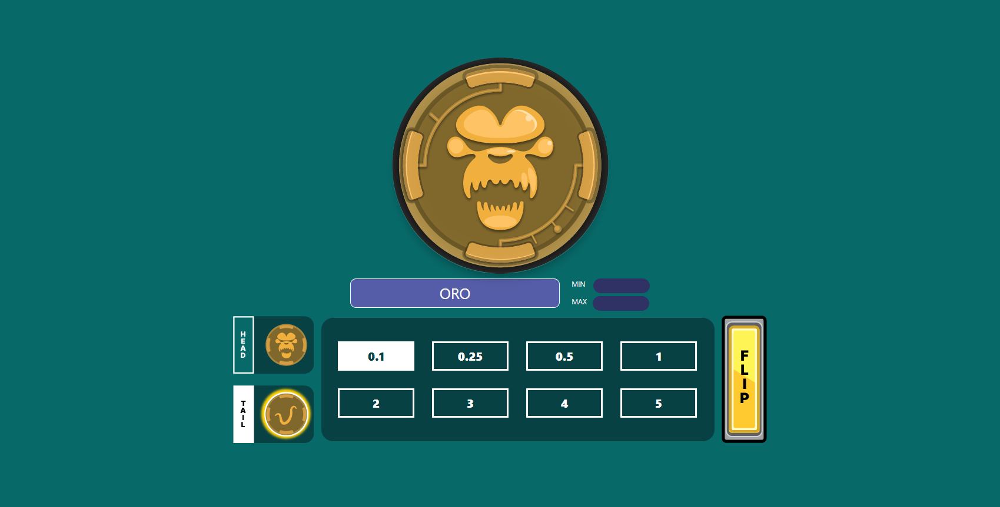

# World Ape CoinFlip 🎲🐵

## World Ape CoinFlip is an interactive coin flip game where users can bet using their ORO tokens. 

[](https://www.youtube.com/watch?v=wSJFY4Ln9xY)



### The game currently supports ORO, with future support for WORLD and ORB tokens in the pipeline. Built on the Worldcoin MiniKit React Template, it consists of three primary components:

1. Frontend: The user interface for players to interact with the game.
2. Backend: Handles the API interactions.
3. Contract: Manages the game's mechanics, including coinflip and token payouts.

## Deployment Instructions
### Prerequisites
Before you start, ensure you have the following installed:
- Node.js (v18 or higher)
- pnpm (v8 or higher)
- A worldchain network RPC (alchemy and thirdweb has free tiers)
- An World App Developer Account
- (Attention: The frontend should always be opened via scanning the QR code obtained from the World App Developer Portal, via Camera so it is redirected to the World App to open. After frontend is updated, please close your World App to remove the previous cache and start loading fresh again.)

### 1. Clone the Repository
```
git clone https://github.com/SkyYap/World-Ape-CoinFlip  
cd world-ape-coinflip  
```

### 2. Install Dependencies
Frontend:
```
cd frontend
pnpm install
```

Backend:
```
cd backend
npm install
```

Contract:
```
cd contract
yarn add
```

### 3. Configure Environment Variables
Frontend:
| Environment Variable      | Description                                 |
|---------------------------|---------------------------------------------|
| `APP_ID`                  | The application ID used for authentication. (include app_) |
| `DEV_PORTAL_API_KEY`      | The API key of developer portal. |
| `WLD_CLIENT_ID`           | The client ID for interacting with the World API. (same as APP_ID currently) |
| `WLD_CLIENT_SECRET`       | The client secret for the World API.        |
| `NEXTAUTH_URL`            | The URL for deployed backend URL.  |


Backend:
| Environment Variable      | Description                                      |
|---------------------------|--------------------------------------------------|
| `WLD_CLIENT_ID`           | The client ID for interacting with the World API. |
| `WLD_CLIENT_SECRET`       | The client secret for the World API.             |
| `AUTH_SECRET`             | The secret key used for authentication purposes. |


Contract:
| Environment Variable           | Description                                      |
|---------------------------------|--------------------------------------------------|
| `PRIVATE_KEY`                  | The private key for signing transactions.        |
| `WORLDCHAIN_SEPOLIA_RPC_URL`   | The RPC URL for connecting to the WorldChain Sepolia network. |
| `WORLDCHAIN_MAINNET_RPC_URL`   | The RPC URL for connecting to the WorldChain mainnet. |


### 4. Deploying
Frontend:
Just run `pnpm run build` and then let render do the job for you

Backend:
Just run `npm run start` and let render do the job for you

Contract:
- `truffle compile`
- `truffle migrate --network worldchain`
- `truffle networks` to check the deployed contract address

### Summary
- Frontend: Available at http://localhost:5174
- Backend: Running at http://localhost:3000
- Contract: Deployed using Truffle

### Future Improvements
- Add support for WORLD and ORB tokens.
- Enhance UI/UX for a smoother experience.
- Explore integrations with other blockchain networks (probably use LayerZero and add some cool features?)

### Disclaimer
The assets used in this project belongs to Utility Ape and was not created by me during the hackathon. I recycled this assets for this hackathon for learning purpose.

I didn't use the below example as nginx 8080 port seems not working for me but I left it here for future reference.
```
# React example of minikit

Apart from a frontend, you'll need a backend, this template contains an example of that as well

## To run, install:

- deps, `cd frontend;pnpm i;cd -;cd backend;pnpm i`
- ngrok - Create a free ngrok account, follow the official [docs](https://ngrok.com/docs/getting-started/)
- nginx - use you favorite package manager :)

### nginx setup

To serve multiple localhost applications through a single ngrok tunnel (only one available for free-tier users), you can use nginx as a reverse proxy. Follow the steps below to set it up:

### Run nginx

Use the config provided in the root of this repo
`sudo nginx -c full/path/to/this/repo/nginx.conf`
or, if you run the command from the root dir
`sudo nginx -c $(pwd)/nginx.conf`

To stop nginx run `sudo nginx -s stop`

### Tunnel through Ngrok

`ngrok http 8080`
The port doesn't matter, make sure it's the `listen` one from nginx config
```
